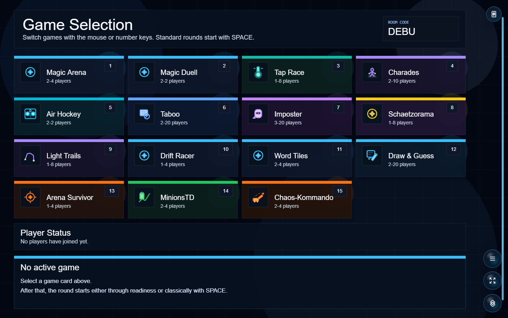
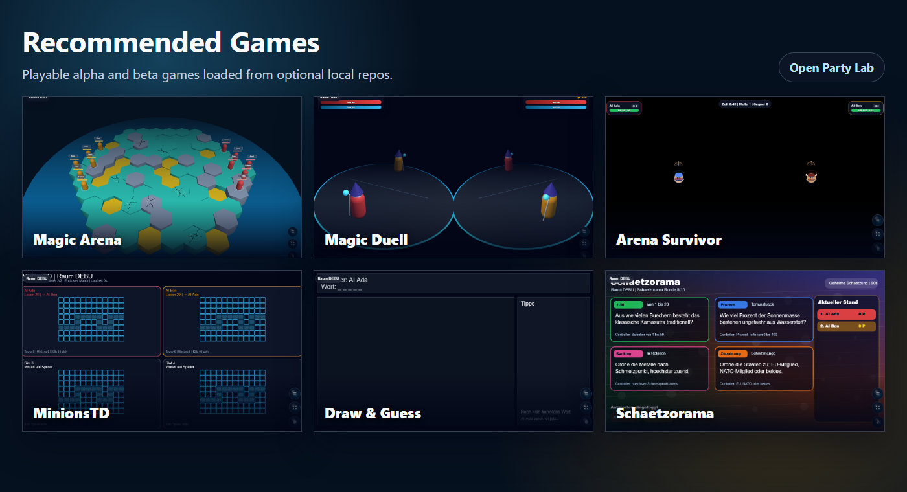

# Open Party Lab

Open Party Lab is a local-first browser party-game platform for shared screens and phone controllers. It is also an experiment in AI-assisted software development: the platform is structured so humans and coding agents can improve games, docs, tests, and tooling in small reviewable steps.



## Current Status

This is a playable local prototype, not a hosted production service. It is designed for devices on the same LAN.

Most games are still alpha. The current recommended games are already good to play locally, but rules, pacing, scoring, content, UI, and balancing are expected to keep changing.



## How It Works

Open Party Lab runs three apps together:

- `apps/server`: authoritative Socket.IO room, round, score, and game-state server
- `apps/host`: Phaser host screen for a TV, monitor, projector, or shared computer
- `apps/controller`: React phone controller used by players in the browser

Shared platform code lives in workspace packages:

- `packages/protocol`: socket events, DTOs, and shared room/game-state contracts
- `packages/game-core`: game manifests, shared game types, round helpers, and layout keys
- `packages/ui-kit`: shared visual tokens
- `packages/utils`: small shared utilities

The platform supports optional multi-repo games. The core platform stays here; individual games can live in separate Git repos under `local-games/`. Missing optional games are normal and are skipped by the generator.

## Quick Start

Requirements:

- Node.js 20+
- npm 10+

From a fresh clone:

```bash
npm ci
npm run games:list
npm run build
```

Run locally on Windows:

```bash
npm run dev:all
```

Run locally on any platform with three terminals:

```bash
npm run dev:server
npm run dev:host
npm run dev:controller
```

Default local URLs:

- Server: `http://localhost:3000`
- Host: `http://localhost:5173`
- Controller: `http://localhost:5174`

If a dev port is already occupied, stop the running stack first:

```bash
npm run dev:stop
```

## Recommended Games

Clone the recommended game repos into `local-games/`:

```bash
npm run games:clone-recommended
npm run games:sync-local
```

Recommended optional local game repos:

| Game | Status | Local path |
| --- | --- | --- |
| Magic Arena | recommended alpha | `local-games/magic-arena` |
| Magic Duell | recommended alpha | `local-games/magic-duell` |
| Arena Survivor | beta, recommended | `local-games/arena-survivor` |
| MinionsTD | beta, recommended | `local-games/minions-td` |
| Zeichnen & Erraten | beta, recommended | `local-games/zeichnen-und-erraten` |
| Schaetzorama | beta, recommended | `local-games/schaetzorama` |

Other optional local game repos:

| Game | Notes | Local path |
| --- | --- | --- |
| Tap Race | playable prototype | `local-games/tap-race` |
| Pantomime | playable prototype | `local-games/pantomime` |
| Air Hockey | playable prototype | `local-games/air-hockey` |
| Tabu | playable prototype | `local-games/tabu` |
| Imposter | playable prototype | `local-games/imposter` |
| Light Trails | playable prototype | `local-games/light-trails` |
| Drift Racer | under construction, currently not playable | `local-games/drift-racer` |
| Word Tiles | playable prototype | `local-games/word-tiles` |
| Chaos-Kommando | playable prototype | `local-games/chaos-kommando` |

Manual clone example:

```bash
git clone https://github.com/Hartwich/magic-arena.git local-games/magic-arena
git clone https://github.com/Hartwich/magic-duell.git local-games/magic-duell
npm run games:sync-local
```

`games:sync-local` builds and links only the local game repos it finds. You do not need every game repo.

New game repos should use the short game name as the repo and folder name, for example `tap-race`, not an `open-party-game-` prefix. Package names can still use the scoped npm shape, for example `@open-party-lab/game-tap-race`.

## Useful Scripts

```bash
npm run games:list
npm run games:sync-local
npm run games:clear-local
npm run games:clone-recommended
npm run ai:controllers
npm run screenshots:readme
npm run dev:all
npm run dev:stop
npm run typecheck
npm run build
```

For AI browser checks, use virtual controllers instead of opening multiple phone browser windows:

```bash
npm run ai:controllers -- --room DEBU --players 4 --ready true --hold-ms 600000
```

To refresh README screenshots, start the server and host first, then run:

```bash
npm run screenshots:readme
```

The screenshot script captures the English host game-selection screen and builds a recommended-games collage from local game screenshots.

## LAN Setup

Phones must reach the server and controller app through the host machine's LAN IP.

Example PowerShell setup:

```powershell
$env:PUBLIC_CONTROLLER_ORIGIN="http://192.168.178.20:5174"
$env:VITE_SERVER_URL="http://192.168.178.20:3000"
```

Then start the platform with `npm run dev:all`, open the host app on the shared screen, and scan the QR code from each phone.

## Browser Notes

Use a Chromium-based browser or Safari for phone controllers when possible. Firefox can work, but controller sessions may sometimes have issues with fullscreen behavior, reconnect/session handling, or touch input timing.

The host screen is intended for a desktop browser. The controller is intended for phone-sized browser windows on the same network as the server.

## Contributing

Good contributions are usually small and vertical:

- playtest one game and open a focused report;
- improve controller text, layout, or feedback on phones;
- improve host-screen readability for a TV or monitor;
- propose balance, pacing, scoring, or rule-clarity improvements;
- add screenshots, docs, setup notes, or small smoke tests;
- build a new mini-game repo using the Mini-Game SDK.

When behavior changes, update the server logic, protocol types, host view, controller model, and docs together when needed.

Start with:

- [AGENTS.md](AGENTS.md)
- [CONTRIBUTING.md](CONTRIBUTING.md)
- [docs/agent-task-guide.md](docs/agent-task-guide.md)
- [docs/architecture.md](docs/architecture.md)
- [docs/minigame-sdk.md](docs/minigame-sdk.md)
- [docs/multi-repo-games.md](docs/multi-repo-games.md)
- [docs/create-a-game.md](docs/create-a-game.md)
- [docs/playtesting.md](docs/playtesting.md)
- [docs/project-status.md](docs/project-status.md)
- [docs/roadmap.md](docs/roadmap.md)

Recommended verification:

```bash
npm run games:list
npm run games:sync-local
npm run typecheck
npm run build
```

Keep generated output, logs, temporary browser profiles, and build artifacts out of source control. If a check cannot be run, state that clearly in the pull request.

Contributions are voluntary and unpaid. The maintainer may publish official builds, including a possible Steam release, to reach a larger player base. See [CONTRIBUTING.md](CONTRIBUTING.md) and [NOTICE.md](NOTICE.md).

## License

Code is licensed under the Apache License 2.0. See [LICENSE](LICENSE).

Assets, names, generated media, third-party references, and store distribution rights need separate care. See [NOTICE.md](NOTICE.md). This repository is not legal advice; get proper legal review before commercial distribution.
