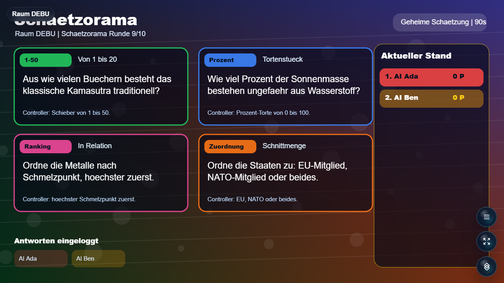

# Schaetzorama

Colorful estimation quiz for Open Party Lab with numeric, ranking, and assignment questions.



## Status

Beta. The multi-category estimating loop is already good to play locally. Still needs question pool growth, scoring review, and controller UX polish before a stable release.

## Run Through Open Party Lab

This repo is not a standalone app. Run it through the Open Party Lab platform.

Recommended layout:

```text
Open-Party-Lab/
  local-games/
    schaetzorama/
```

From the Platform repo:

```bash
npm install
npm run games:sync-local
npm run dev:all
```

The Platform loads this game only when the repo exists locally and `npm run games:sync-local` links it. Missing optional games are skipped.

## GitHub Metadata

Description:

```text
Colorful estimation quiz for Open Party Lab with numeric, ranking, and assignment questions.
```

Suggested topics:

```text
open-party-lab party-game browser-game phaser typescript local-multiplayer quiz-game
```

## Package Entrypoints

- `@open-party-lab/game-schaetzorama/manifest`
- `@open-party-lab/game-schaetzorama/protocol`
- `@open-party-lab/game-schaetzorama/server`
- `@open-party-lab/game-schaetzorama/host`
- `@open-party-lab/game-schaetzorama/controller`

The Platform should import only these public entrypoints.

## Development Checks

```bash
npm install
npm run typecheck
npm run build
npm run pack:dry-run
```

For visual checks, start Open Party Lab, add virtual controllers when needed, and capture host screenshots through a browser.

## License

Code is licensed under the Apache License 2.0. See [LICENSE](LICENSE).

Assets, generated media, word lists, prompts, and third-party references may need separate rights review before public store distribution.
